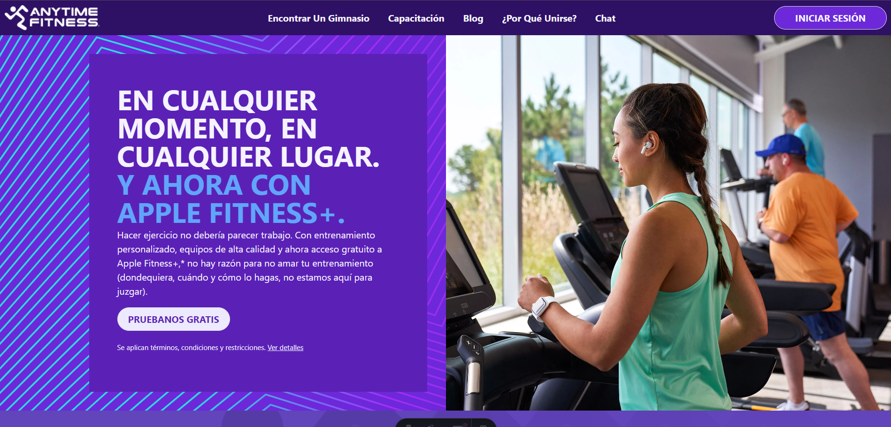
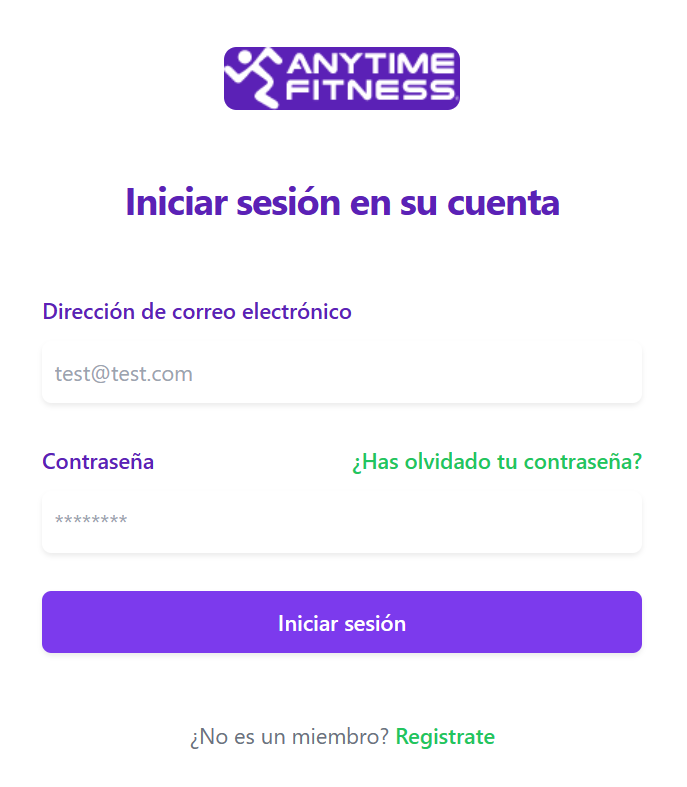
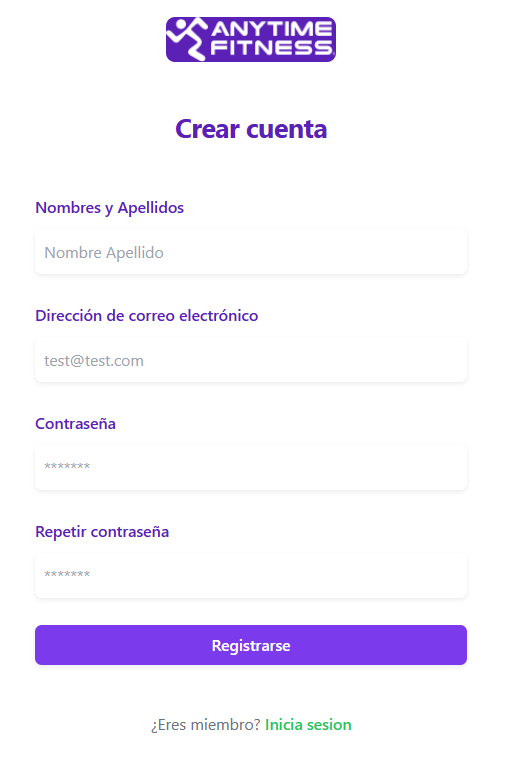

# PROYECTO Anitime Fitness

URL de la pagina desplegado en Netlify

https://main--anytime-fitness-webav.netlify.app/

## Paginas

### Inicio


### Login


### Crear cuenta


## 🚀 Project Structure

Inside of your Astro project, you'll see the following folders and files:

```text
/
├── public/
│   └── favicon.svg
├── src/
│   ├── components/
│   |   └── admin/
│   |   └── auth/
│   |   └── Footer.astro
│   |   └── Inicio.astro
│   |   └── Mensajes.astro
│   |   └── Navbar.astro
│   ├── layouts/
│   |   └── Layout.astro
│   ├── pages/
│   |   └── chat.astro
│   |   └── dashboard.astro
│   |   └── index.astro
│   |   └── login.astro
│   |   └── mail.astro
│   |   └── register.astro
|   ├── scripts/
│   |   └── admin/
│   |   └── auth/
│   |   └── firebase/
│   |   └── mensajes.js
│   |   └── navbar.js
|   ├── styles/
│      └── global.css
└── package.json
```

## 🧞 Commands

All commands are run from the root of the project, from a terminal:

| Command                   | Action                                           |
| :------------------------ | :----------------------------------------------- |
| `npm install`             | Installs dependencies                            |
| `npm run dev`             | Starts local dev server at `localhost:4321`      |
| `npm run build`           | Build your production site to `./dist/`          |
| `npm run preview`         | Preview your build locally, before deploying     |
| `npm run astro ...`       | Run CLI commands like `astro add`, `astro check` |
| `npm run astro -- --help` | Get help using the Astro CLI                     |

## 👀 Want to learn more?

Feel free to check [our documentation](https://docs.astro.build) or jump into our [Discord server](https://astro.build/chat).
